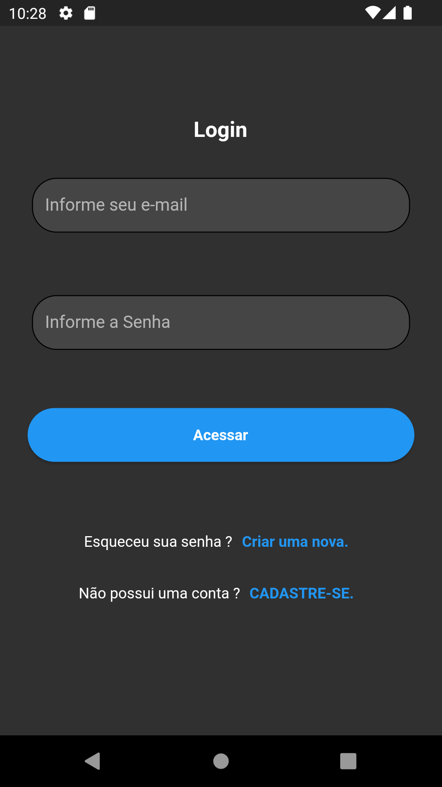
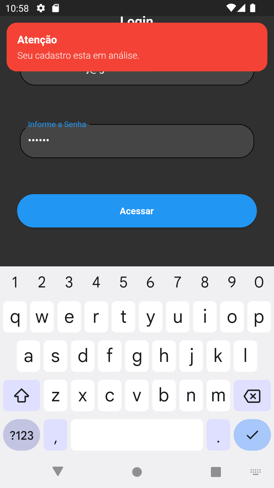
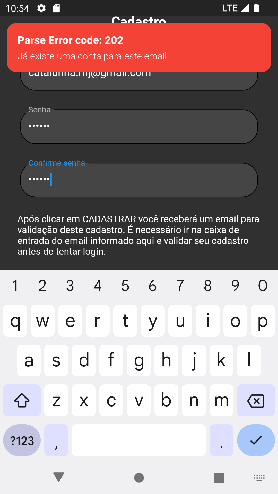
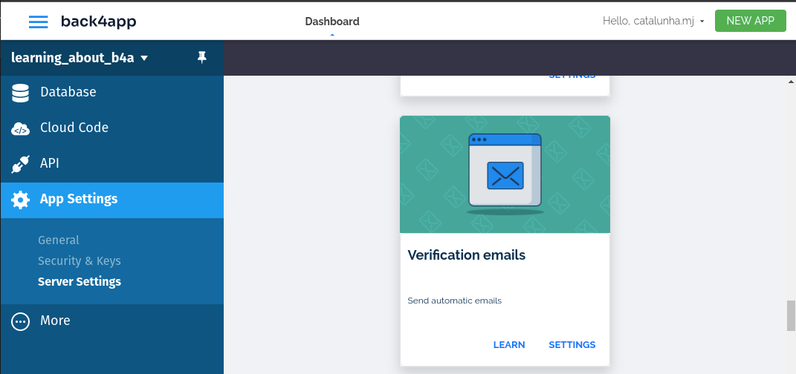
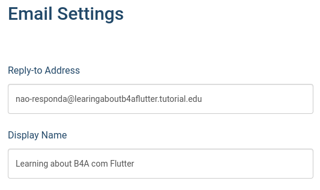
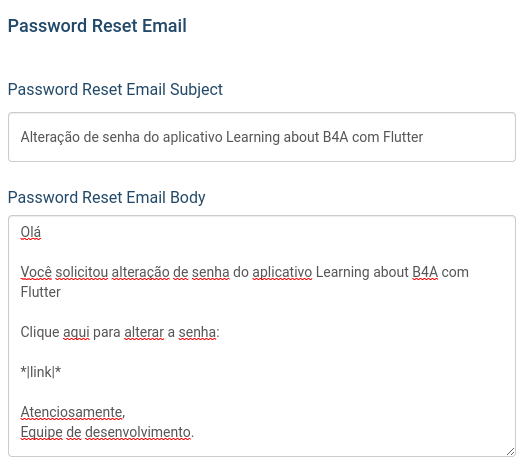
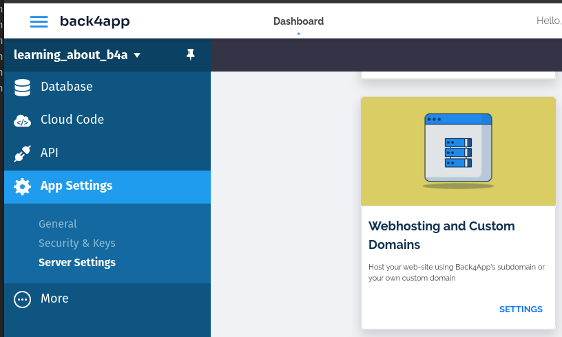
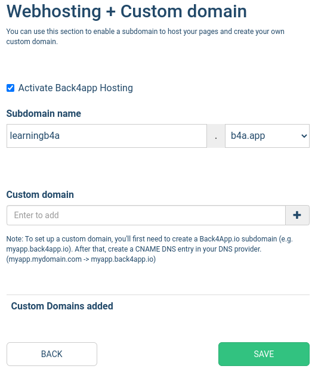

# learning_about_b4a_flutter

Deixe uma issue com suas sugestões e,ou criticas sobre este material. Ajudará muito na remodelagem deste e construção de outros.

Aqui compartilharei com você minhas experiências e aceito suas sugestões de como realizar um login utilizando o back4app.com. Este projeto servirá também pra eu refinar este código para outras projetos. No final aprenderemos juntos... 

Para entender melhor este repositório é importantíssimo assistir a primeira parte disponivel neste outro repositorio:

https://github.com/catalunha/learning_about_b4a_dart

Em seguida assista aos videos desta playlist, https://www.youtube.com/playlist?list=PL-rdGqWQhUziIYWzcd4x3dJjp_qiWiDYt, nesta seguencia. Ou acesse cada video individualmente.

1. Introdução (https://youtu.be/VBzItwVTPDY) 
2. Tables User & Profile (https://youtu.be/i0l-JqZqJuo)
3. EmailVerified (https://youtu.be/rAT1oabrs-4)
4. App (https://youtu.be/Qk9uY8IXaSA)
5. Pubspec (https://youtu.be/9BWDN1TElgo)
6. Splash (https://youtu.be/H0CVXHlrVpc)
7. Login (https://youtu.be/_rlj9Uahwow)
8. RegisterEmail (https://youtu.be/7Dyq1L9Fqys)
9. Home (https://youtu.be/iBcpLiu_kPc)
10. EditProfile (https://youtu.be/1a7qbahK6Pg)
11. List (https://youtu.be/N_1xluOm2oI)
12. Testes (https://youtu.be/ScPnIVKXAWc)
13. Cloud Code e Web Hosting (https://youtu.be/uY72rdCb9sI)

A seguir apresento algumas anotações utilizadas nos videos e registrada aqui pra facilitar.

# Apresentação do projeto Flutter

Splash | Login | Cadastro
---|---|---
|||

Email Não verificado | Acesso não liberado | Email ja cadastrado
---|---|---
|||

Home | Editar profile | Listar tabela
---|---|---
|||

# b4a - Class Profile
Criar table Profile com os campos [email,typeString,typeFile,isActive]


# b4a - Class User
Criar campo [profile] e apontar para Profile
Destacar a importancia do campo emailVerified


# b4a Config - Email Verification
Acessar Server Settings e configurar email verification

Exemplo de configuração para verificação de email


Exemplo de configuração para recuperação de senha

Email recebido quando usuario cadastrado.

Email Verificado e atualizado no database do back4app

Antes da verificação de email

Após a verificação de email


# App Flutter - Classes
1. Criar projeto em Flutter  no terminal
flutter create --project-name=learning_about_b4a_flutter --org br.catalunhamj --platforms android,web ./learning_about_b4a_flutter
2. Configurar pubspec.yaml
   1. images
   2. .env com .gitignore
3. lib/main.dart
4. lib/app/app.dart
5. lib/app/routes.dart
6. lib/app/core
   1. lib/app/core/models
      1. lib/app/core/models/user_model.dart
      2. lib/app/core/models/profile_model.dart
   2. lib/app/core/utils
7. lib/app/data/repositories
8. lib/app/data/b4a
   1. lib/app/data/b4a/connect_b4a.dart
   2. lib/app/data/b4a/entity
   3. lib/app/data/b4a/table
   4. lib/app/data/b4a/utils
9. Splash
   1.  lib/app/view/controllers/splash
   2.  lib/app/view/pages/splash
10. Register via email
11. Login
12. Home
    1.  Edit Profile
13. List


# App Flutter - Versão Web
Primeira etapa é construir o codigo em versão web com este comando:
`catalunha@pop-os:~/myapp/learning_about_b4a_flutter$ flutter build web`
Depois executar com F5 para ver o resultado e tudo funcionando conforme versão no Android.


# Web Hosting na b4a
Acessando ao App Settings -> Server Settings -> Webhosting 

Poderemos configurar as informações de hospedagem.


Localmente precisamos configurar o projeto localmente para deploy com os seguintes comandos:
`catalunha@pop-os:~/myapp/learning_about_b4a_flutter/back4app$ b4a new`

```
catalunha@pop-os:~/myapp/learning_about_b4a_flutter/back4app$ b4a new
Would you like to create a new app, or add Cloud Code to an existing app?
Type "(n)ew" or "(e)xisting": e
6:      learning_about_b4a
Select an App to add to config: 7

Please enter the name of the folder where we can download the latest deployed
Cloud Code for your app "learning_about_b4a"

Directory Name: 
You can either set up a blank project or download the current deployed Cloud Code
Please type "(b)lank" if you wish to setup a blank project, otherwise press ENTER: 
Successfully downloaded Cloud Code to "/home/catalunha/myapp/learning_about_b4a_flutter/back4app/learning_about_b4a".
Successfully configured email for current project to: "catalunha.mj@gmail.com"
```

## link build/web in b4a_project/public
Como anteriormente ja construimos a aplicação web podemos linkar o build/web com o public do b4a. Usando para isto um link simbólico.

```
catalunha@pop-os:~/myapp/learning_about_b4a_flutter/back4app/learning_about_b4a$ ln -s /home/catalunha/myapp/learning_about_b4a_flutter/build/web public`

catalunha@pop-os:~/myapp/learning_about_b4a_flutter/back4app/learning_about_b4a$ ls -la
total 20
drwxr-xr-x 3 catalunha catalunha 4096 Dec 13 09:20 .
drwxrwxr-x 3 catalunha catalunha 4096 Dec 13 08:10 ..
drwxr-xr-x 3 catalunha catalunha 4096 Dec 13 08:15 cloud
-rw------- 1 catalunha catalunha  187 Dec 13 08:10 .parse.local
-rw------- 1 catalunha catalunha  100 Dec 13 08:10 .parse.project
lrwxrwxrwx 1 catalunha catalunha   58 Dec 13 09:20 public -> /home/catalunha/myapp/learning_about_b4a_flutter/build/web
```

## Cloud function
A função em núvem que utilizaremos para atualizar as tabelas de User e Profile serão estas.
E deve ser coloca em 
`catalunha@pop-os:~/myapp/learning_about_b4a_flutter/back4app/learning_about_b4a/cloud$`
```js
Parse.Cloud.afterSave(Parse.User, async (req) => {
  let user = req.object;
  if (user.get('profile') === undefined) {
    const profile = new Parse.Object("Profile");
    profile.set('email', user.get('email'));
    let profileResult = await profile.save(null, { useMasterKey: true });
    user.set('profile', profileResult);
    await user.save(null, { useMasterKey: true });
    console.log(`afterSave Parse.User: ${user.id} Created profile.`);
  }
});

Parse.Cloud.afterDelete(Parse.User, async (req) => {
  let user = req.object;
  console.log(`afterDelete Parse.User: ${user.id}`);
  let profileId = user.get('profile').id;
  console.log(`deleting Profile: ${profileId}`);
  const profile = new Parse.Object("Profile");
  profile.id = profileId;
  await profile.destroy({ useMasterKey: true });
});
```

## b4a deploy
Lembre-se sempre de construir o build primeiro
catalunha@pop-os:~/myapp/learning_about_b4a_flutter$ flutter build web
Depois subir o deploy
catalunha@pop-os:~/myapp/learning_about_b4a_flutter/back4app/learning_about_b4a$ b4a deploy

# .env
Ainda estou resolvendo a forma correta para colocar as variáveis de ambiente no b4a e obté-las no Flutter. 
Mas após o deploy envie individualmente o arquivo .env para public/assets no hosting do b4a

Assim a aplicação conectará perfeitamente ao banco de dados.


# issues & Tickets

help.back4app.com/hc/requests/32443

